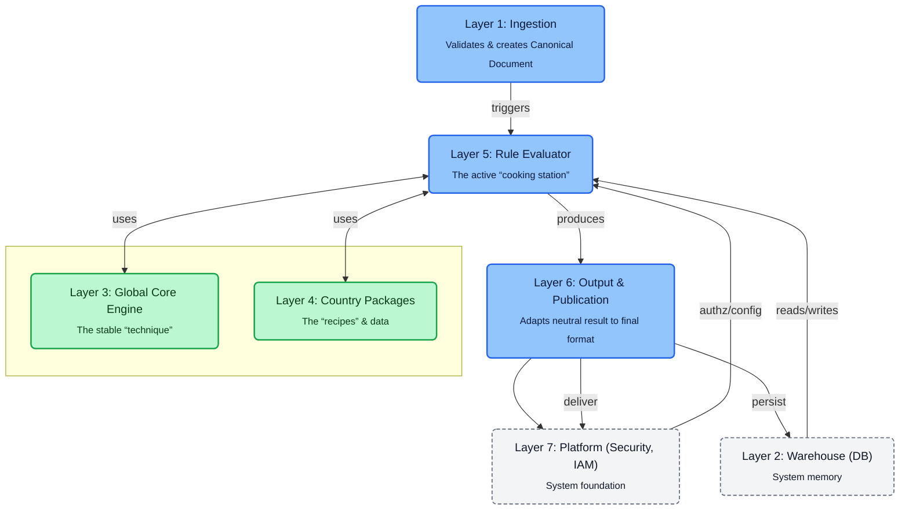
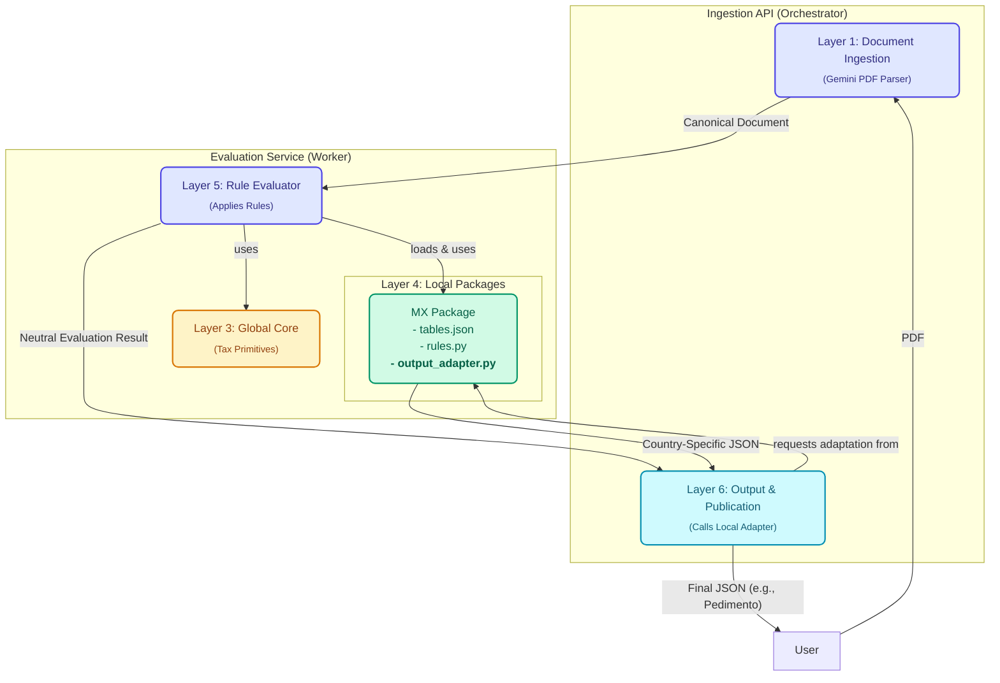

# Customs Declaration System Proof-of-Concept

This project outlines a two-service microservice architecture for parsing and processing customs documents.
This repository contains an MVP for transforming trade documents (invoices, packing lists, etc.) into official customs declarations,
featuring a global core engine and country-specific local packages (e.g., for Mexico's "Pedimento A1").

## Key Technologies

- Backend: Python with FastAPI & Pydantic
- Powered by AI: Utilizes Google's Generative AI SDK with the Gemini model for document analysis.
- Containerization: Docker and Docker Compose

## Architecture

The system is designed around a 7-layer model. This MVP implements the core logic for layers 1, 3, 4, 5, and 6, while simulating layers 2 and 7.

- Layer 1: API Gateway & Ingestion: Receives documents, authenticates requests (simulated), validates, and parses them into a canonical data model using the Gemini AI engine.
- Layer 2: Multi-Tenant Warehouse: Secure, multi-tenant storage. In this MVP, this is simulated in system memory. In production, this would be a database with Row-Level Security.
- Layer 3: Global Core Engine: A deterministic set of primitives for country-agnostic calculations (e.g., ad-valorem tax formulas, currency conversion).
- Layer 4: Local Packages: Contains versioned, country-specific logic, including official data tables (tables.json), business rules (rules.py), and output formatters (output_adapter.py).
- Layer 5: Stateless Rule Evaluator: Executes rules from a local package against a canonical document, generating a neutral result and a traceable evidence log.
- Layer 6: Output & Publication: Renders the neutral evaluation result into a local format (e.g., Mexico's Pedimento A1) for final review and submission.
- Layer 7: Platform Services: Cross-cutting concerns like identity/access management, encryption, and secrets management.



## Implementation

-   **`ingestion-api`**: A public-facing orchestrator that accepts photographs or scans of documents, uses Google's Gemini AI to parse them into a canonical format, and calls the evaluation service to process them.
-   **`evaluation-service`**: An internal, stateless worker that contains the core calculation logic. It is composed of a `global_core` for reusable primitives and `local_packages` for country-specific rules and output formats.

The demo implementation covers 5 of the 7 layers as shown below.



## Security & Compliance

### Threat Model

| Threat | Description | Mitigation |
| :--- | :--- | :--- |
| **Unauthorized Access** | An external or internal actor gains access to data they are not authorized to see. | **IAM (RBAC/ABAC)**: Implement Role-Based and Attribute-Based Access Control. Enforce MFA for administrative roles. |
| **Data Leakage** | Data from one tenant (`org_id`) is inadvertently exposed to another. | **Data Isolation**: Enforce `org_id` filtering on every database query (RLS). Implement service-to-service authentication (e.g., mTLS or JWT) to ensure internal requests are trusted. |
| **Data Tampering** | An attacker modifies data in transit or at rest. | **Encryption**: Enforce TLS 1.2+ for all data in transit. Encrypt all sensitive data at rest using a KMS. |
| **Compliance Errors** | A bug in a country package leads to incorrect customs calculations, resulting in fines. | **Governance & CI/CD**: Enforce a maker-checker PR review process for all package changes. Use a curated set of test cases to prevent regressions. |
| **Secret Leakage** | API keys or database credentials are exposed in source code or logs. | **Secrets Management**: Never store secrets in code. When complexity becomes too high, use a dedicated service like HashiCorp Vault or AWS Secrets Manager. |

### Multi-Country Compliance Governance

The core principle is that the **Global Core Engine is never modified to add a new country**. Compliance is managed entirely within the **Local Packages**.

1.  **Country Package Structure**: Each package is a self-contained unit with:
    *   **Tables/Parametry (`tables.json`)**: Official, versioned data (tax rates, HS codes, thresholds) that can be updated without code changes.
    *   **Rules (`rules.py`)**: The declarative logic that applies the tables to a canonical document.
    *   **Output Adapter (`output_adapter.py`)**: A mapper that transforms the neutral evaluation result into the country's specific declaration format.
2.  **Change Management**: All changes to a country package must go through a Pull Request with a mandatory "maker-checker" review process by at least one other team member.
3.  **Automated Testing**: Each PR automatically triggers a CI pipeline that runs a curated set of test cases for that country. These tests cover a range of scenarios, including common and edge cases, and assert that the final calculated totals match pre-approved, expected results to prevent regressions.

## Design Methodology

### Assumptions and Decisions

-   **Assumption**: Scalability and long-term maintainability are the most important considerations. A modular architecture builds resilience and provides flexibility for future enhancements, such as agentic workflows.
-   **Decision**: A **Microservices architecture** was chosen over a monolith. This allows the `ingestion-api` (which might be I/O-bound due to AI calls) to scale independently from the `evaluation-service` (which is CPU-bound). It also allows for independent deployment of country packages.
-   **Decision**: Use a **Stateless `evaluation-service`**. This simplifies horizontal scaling; we can add more instances of this service behind a load balancer without worrying about session state.
-   **Decision**: Employ an **AI-first approach for ingestion**. This handles the high variability of real-world documents but accepts a trade-off: results may require human review. The `evidence` log provides the necessary traceability for this review.
-   **Alternative Discarded**: A monolithic architecture. This was discarded due to concerns about long-term maintainability and the difficulty of separating components for future enterprise-level deployments.

## Roadmap (30-60-90 days)

- 30 Days (MVP Hardening):
	- Implement Persistent Warehouse: Replace the in-memory simulation with a PostgreSQL database to store canonical documents and evaluation results.
    - Implement Authentication: Secure the `/documents/process` endpoint with JWT-based authentication.
    - Ship Dashboard: Integrate the system into Camtom's user-facing platform.
    - Add Logging & Tracing: Integrate structured logging (e.g., Loki Stack or ELK Stack) and OpenTelemetry for observability across both services.

- 60 Days (Production Readiness & Second Country):
	- Build Full CI/CD Pipeline: Automate the build, testing (including "golden set" validation), and deployment of both services.
	- Develop Review UI: Create a simple web interface for operators to review low-confidence AI parsing results.
	- Develop Second Country Package: Begin development of a new package (e.g., co-impo-def-v0.1.0 for Colombia) to validate the extensibility of the architecture.

- 90 Days (Scale & Usability):
	- Deploy Second Country Package: Release the new country package to production using a feature flag.
    - Broader Americas Expansion: Capitalize on feedback from the second country's deployment and begin accelerated expansion.

## Prerequisites for this Demo

-   Docker and Docker Compose
-   A Google AI API Key with the Gemini API enabled. You may get one for free at https://aistudio.google.com/apikey

## How to Run

1.  **Set Environment Variable**: Create a secret for your Google AI API Key. You can place it in a `.env` file in the root directory.

    ```sh
    # .env file
    GOOGLE_GENAI_API_KEY="YOUR_API_KEY_HERE"
    ```
    `docker compose` will automatically pick up the `.env` file.

2.  **Build and Start Services**:
    ```sh
    docker compose up --build -d
    ```

3.  **Check Service Health**:
    -   Ingestion API: `curl http://localhost:8000/health`
    -   Evaluation Service: `curl http://localhost:8001/health`
    -   Evaluation Service (via Docker network): `curl http://localhost:8000/health/ingestion-api`

4.  **Stop Services**:
    ```sh
    docker compose down
    ```

## API Usage

Send a `POST` request with a PDF file to the `ingestion-api`.

**Endpoint**: `POST http://localhost:8000/documents/process`

**Request Type**: `multipart/form-data`

**Form Fields**:
-   `file`: The PDF document to process.
-   `jurisdiction`: (string, required) The country code (e.g., "MX").
-   `org_id`: (string, required) Your organization's ID.

**Example `curl` command:**

```bash
curl -X POST "http://localhost:8000/documents/process" \
  -F "file=@/path/to/your/invoice.pdf" \
  -F "jurisdiction=MX" \
  -F "org_id=acme-corp-mx"
```

**Success Response (200 OK):**
The response will contain the parsed canonical document and the final, country-specific declaration JSON.
```json
{
  "status": "success",
  "parsed_canonical_document": {
    // ... canonical JSON from the provided scan or photograph ...
  },
  "evaluation_result": {
    // ... Taxes, Measures, Evidence ...
  },
  "final_declaration": {
    // ... final Pedimento A1-style JSON from the adapter ...
  }
}
```
